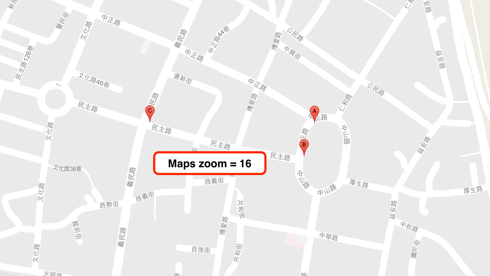
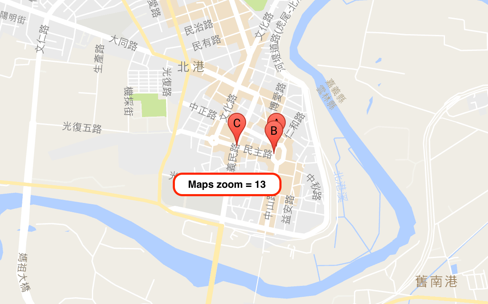

# Welcome To OA's Marker Clustering！
各位 [Google Maps JavaScript API](https://developers.google.com/maps/documentation/javascript/tutorial?hl=zh-tw) 的玩家都應該有過 [Marker](https://developers.google.com/maps/documentation/javascript/markers?hl=zh-tw) 太多時，當 Maps 視角一拉遠時，全部 Marker 擠在一起的困擾吧！沒錯 [OA's Marker Clustering](https://github.com/comdan66/OA-markerClustering) 就是要來處理這個困擾！

---
## 聲明
本作品授權採用 姓名標示-非商業性 2.0 台灣 (CC BY-NC 2.0 TW) 授權，詳見 [http://creativecommons.org/licenses/by-nc/2.0/tw/](http://creativecommons.org/licenses/by-nc/2.0/tw/)


<br/>
## 簡介
或許你/妳會問，市面上也有很多關於 Marker Clustering 的 Library，那又何必自己時做一套呢！？原因很簡單，因為自己做的比較能夠掌握概況，視需求去做調整，不用一大包的 code，到底怎麼跑的都摸不透，並且加以利用做出自己想要的功能！

如果試著 Google 關於 [Marker Clustering](https://developers.google.com/maps/documentation/javascript/marker-clustering) 的文章都會找到 Marker Clustering 此篇，而官網上也都推崇 [這套](https://github.com/googlemaps/js-marker-clusterer) Library，這套我也開發過，甚至改過其功能，但是最後我還是自己刻了屬於自己的 [Marker Clustering](https://works.ioa.tw/OA-markerClustering/index.html) 來制定當不同的 集合 Marker 時可以使用不同呈現方式！以下就是一些功能介紹、演算方法說明。

<br/>
##概略方法
[OA's Marker Clustering](https://works.ioa.tw/OA-markerClustering/index.html) 主要規則就是利用 Google Maps 在不同的放大視角(以下以 zoom 代稱)時產生 **集合 Marker**，而這些 Marker 用來代表著是多數 Marker 集合。如下圖 1 是 zoom 為 16 時的狀況圖，地圖上分別有 A、B 以及 C 三個點，而圖 2 代表在 zoom 為 13 時，因為地圖視角拉遠了，所以造成 A 與 B 互相太靠近，所以必須隱藏 B 只顯示 A，所以作法如圖 3，產生一個 集合 Marker 放置在 A 的位置，並且記錄著數量為 2。


▲ zoom 為 16 時的狀況圖，地圖上分別有 A、B 以及 C 三個點。


▲ 地圖視角 zoom 為 13 時，因為視角拉遠所以造成 A 與 B 互相太靠近。


▲ 因靠太近，故隱藏 B 只顯示 A，產生一個 集合 Marker 放置在 A 的位置，並且記錄著數量為 2。


<br/>
##功能介紹
這次的 [OA's Marker Clustering](https://works.ioa.tw/OA-markerClustering/index.html) 中，我拆出兩種 Type，分別是 **moveRun**、**runAll**，其兩者在地圖上的呈現結果差不多，但方法是不一樣的。前者 moveRun 是當地圖移動完後(idle Listener)，先取得地圖的範圍座標([Bounds](https://developers.google.com/maps/documentation/javascript/reference))，在塞選(filter)出地圖範圍內的座標點，再依照這些座標點去製作各個 集合 Marker。而後者的 runAll 型態則是當一開始新增玩所有點之後，立即運算出當地圖在各個 zoom 分別的 集合 Marker，當地圖 zoom 大小改變時，則可以立即得找出該 zoom 下的 集合 Marker 顯示。

Type moveRun 當地圖移動時，會重新針對範圍內做計算再合併出 集合 Marker，所以會移除舊的在上新的，整體初始速度較快，但當地圖移動時會有閃娑狀況，反之 runAll 因為開始先算出所有不同 zoom 時要顯示的結果，所以當地圖移動(平滑非放大)時，因為不用移除舊的，所以不會有閃爍狀況發生，但初始速度較慢。以下就是兩者不同 type 的 Demo。

<br/>
##程式範例
因為是要配合 Google Maps JavaScript API 使用的 Library，所以就寫在 `google.maps.event.addDomListener (window, 'load', function () {});` 內較為保險。首先新增 OAMarkerClustering 物件，並且給予 Maps 物件，以及相關設定，範例如下：

```
// 宣告初始地圖
var maps = new google.maps.Map ($('#maps').get (0), {
  zoom: 8,
  center: new google.maps.LatLng (23.8, 120.8)
});

// 宣告 OAMarkerClustering 物件
var cluster = new OAMarkerClustering ({
  maps: maps,
  type: 'moveRun' // 分別有 moveRun、runAll
}
```

<br/>
接著設定各個點的資訊，這邊有兩種方式提供，分別是 **google.maps.LatLng 物件陣列**、**二維坐標陣列**，其分別可以用 setLatLngs、setArrays 去做設定，範例如下：

```
// 四個 Demo 點
var points = [[21.899171, 120.854535], [21.905981, 120.852092], [21.922511, 120.738746]];

// 轉換成 google.maps.LatLng 物件陣列
var latLngs = points.map (function (t) {
  return new google.maps.LatLng (t[0], t[1]);
});

// 設置所有點
cluster.setLatLngs (latLngs);

// 使用 二維坐標陣列 的話可以使用 setArrays，如下：
// cluster.setArrays (points);
```

<br/>
最後分別設定 **單點 Marker** 與 **集合 Marker** 要顯示的物件風格，單點 Marker 使用 setMarker，集合 Marker 使用 setClusteringMarker，其方式主要是利用回傳 Callback 結果來取得 google.maps.Marker 物件。

在 **setMarker** 的第一個參數代表該點的資訊，使用 setLatLngs 的話，則第一個參數就為該點 google.maps.LatLng 資訊，反之若是使用 setArrays，則第一參數就為 坐標陣列。而 **setClusteringMarker** 第一參數比照 setMarker 的規則，而第二參數就是此 集合 Marker 的 單點 Marker 數量！範例如下：

```
cluster.setClusteringMarker (function (e, count) {
  // 設置 集合 Marker 集合樣式，第一個參數為該點資訊，第二個參數為集合了多少點

  // 利用 MarkerWithLabel 來作為 集合 Marker 的顯示
  return new MarkerWithLabel ({
      map: maps,
      position: e,
      labelContent: count,
      labelAnchor: new google.maps.Point (40 / 2, 40 / 2),
      labelClass: 'clustering',
      icon: {path: 'M 0 0'},
    });
});

cluster.setMarker (function (e) {
  // 設置 單個 Marker 樣式，第一個參數為該點資訊
  
  return new google.maps.Marker ({
      map: maps,
      position: e,
    });
});
```

<br/>
以上就是使用的流程簡介，相關程式範例可以參閱 [GitHub](https://github.com/comdan66/OA-markerClustering) 資源，亦或者直接檢視 [介紹說明頁面](https://works.ioa.tw/OA-markerClustering/about.html) 的 [JavaScript 檔](https://github.com/comdan66/OA-markerClustering/blob/master/js/about.js)。

--